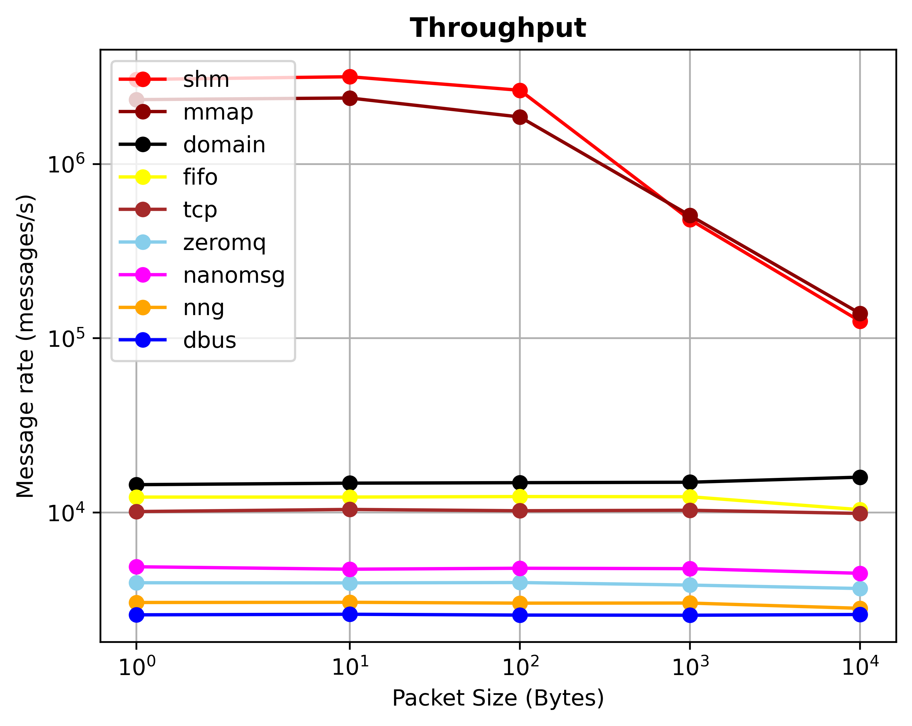

# IPC-Bench

A sample implementations and benchmarks for various inter-process-communication (IPC) mechanisms and libraries on Linux.

*source* folder contains the mechanisms that can be benchmarked.

To measure their sequential throughput we send a single message forth _and_ back (i.e., *ping pong*) between two processes.


## Usage

Some required packages on Ubuntu:
```shell
sudo apt-get install libexpat-dev libsigc++-2.0-dev m4 pkg-config python3-pip
```

You can build the project and all necessary executables using CMake. The following commands (executed from the root folder) should do the trick:

```shell
./install-dependencies.sh
mkdir cmake-build-debug
cmake -B cmake-build-debug -S . -DCMAKE_BUILD_TYPE=Debug -DCMAKE_PREFIX_PATH=temp/third_party/install
cmake --build cmake-build-debug --parallel 8
```

This will generate a `cmake-build-debug/source` folder, holding further directories for each IPC type.
Simply execute the program named after the folder, e.g. `cmake-build-debug/source/shm/shm`.
Where applicable, this will start a new server and client process, run benchmarks and print results to `stdout`. For example, running `cmake-build-debug/source/shm/shm` outputs:

```
============ RESULTS ================
Message size:       4096
Message count:      1000
Total duration:     1.945      	ms
Average duration:   1.418      	us
Minimum duration:   0.000      	us
Maximum duration:   25.000     	us
Standard deviation: 1.282      	us
Message rate:       514138     	msg/s
=====================================
```

To control the number of messages sent and the size of each message, each master executable (which stars the server and client) takes two optional command-line arguments:

* `-c <count>`: How many messages to send between the server and client. Defaults to 1000.
* `-s <size>`: The size of individual messages. Defaults to 4096.

For example, you can measure the latency of sending 100 bytes a million times via domain sockets with the following command:

```shell
$ ./domain -c 1000000 -s 100
```

We also provide a Python script under `benchmark.py` that runs configured mechanisms with various configurations and stores the results.
Some tests may have issues due to system limits, so you may want to re-run the script or run some tests manually.

*plotBenchmarks.py* script can be configured to plot the throughput results from the *benchmark.py* script.

## Sample Results

Absolute numbers will vary across different systems.



## Contributions

Contributions are welcome, as long as they fit within the goal of this benchmark: sequential single-node communication.

Just open an issues or send a pull request.

## License

This project is released under the MIT License.
